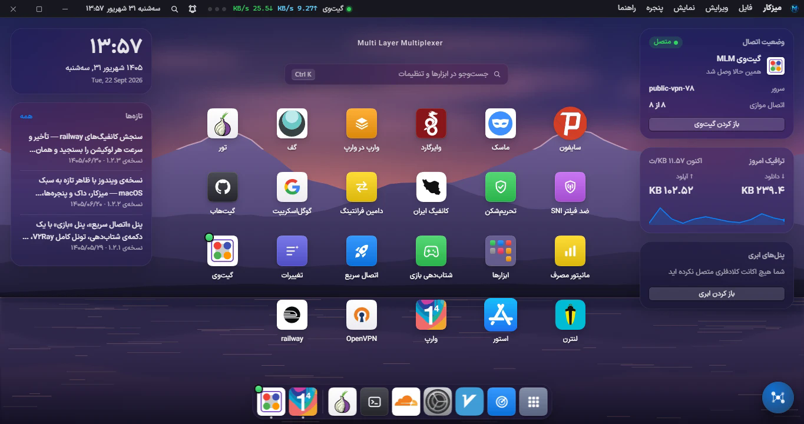

<div align="center">

# MLMVPN برای ویندوز

**یک برنامهٔ دسکتاپ ضدفیلترینگ چندموتوره، اسکنر آی‌پی تمیز، و مدیر زیرساخت کلادفلر — در یک برنامه.**

[](https://github.com/mlmvpn/mlmvpn_windows/releases)
[](#پیش‌نیازها)
[](https://electronjs.org)
[](LICENSE)

[English](README.md) · **فارسی**



</div>

---

## این چیست

بیشتر ابزارهای ضدفیلتر یک موتور دارند و یک کلید. این یکی، محیطی است برای **چهارده موتور** — و
دلیلش تزئینی نیست، اندازه‌گیری‌شده است: **هیچ ترنسپورتی روی همهٔ شبکه‌ها زنده نمی‌ماند.** روی یک
اپراتور موبایل ایران، دست‌دادن WireGuard هرگز کامل نمی‌شود ولی WebSocket روی TLS به لبهٔ کلادفلر
کار می‌کند؛ روی اپراتور بعدی دقیقاً برعکس. پس برنامه موتورها را کنار هم نگه می‌دارد، روی همین
ماشینی که اجرا شده می‌سنجدشان، و می‌گوید **همین‌جا، همین حالا** کدام‌شان واقعاً کار می‌کند.

و کاری را هم می‌کند که اصلاً این موتورها را قابل‌استفاده می‌کند: **پیدا کردن آی‌پی تمیز.** یک آدرس
لبهٔ CDN که هنوز به چشم فیلتر نیامده، تفاوت بین کانفیگی که وصل می‌شود و همان کانفیگ که تایم‌اوت
می‌خورد است. اسکنر برای پیدا کردن همین آدرس‌ها و **اثبات کارکردنشان** قبل از اعتماد به آن‌ها ساخته شده.

همه‌چیز روی زیرساخت خودِ کاربر یا شبکه‌های عمومی رایگان اجرا می‌شود. **هیچ سروری از MLMVPN در مسیر
داده نیست.**

> **یک نکته دربارهٔ اینکه این نرم‌افزار برای چیست.** این برنامه ترافیک شبکه را مسیریابی می‌کند و
> تنظیمات شبکهٔ سیستم‌عامل را تغییر می‌دهد — resolver های DNS، مسیرها، فایروال ویندوز، پروکسی
> سیستم. قانونی بودن اجرای آن برای شما، بر عهدهٔ خودتان است. [SECURITY.md](SECURITY.md) توضیح
> می‌دهد که چطور طوری ساخته شده که در خرابی **ببندد، نه نشت کند**.

---

## فهرست

- [مهم‌ترین امکانات](#مهم‌ترین-امکانات)
- [موتورها](#موتورها)
- [پیش‌نیازها](#پیش‌نیازها)
- [نصب](#نصب)
- [ساخت از روی سورس](#ساخت-از-روی-سورس)
- [ساختار برنامه](#ساختار-برنامه)
- [مستندات](#مستندات)
- [نقشهٔ پروژه](#نقشهٔ-پروژه)
- [مشارکت](#مشارکت)
- [پروانه](#پروانه)
- [سازنده و ارتباط](#سازنده-و-ارتباط)

---

## مهم‌ترین امکانات

### اسکنر آی‌پی تمیز
محدوده‌های آدرس CDN — کلادفلر، Fastly، Akamai و بقیه — را جارو می‌کند و می‌گوید کدام آدرس‌ها جواب
می‌دهند، با چه سرعتی، و از کجا. نتیجه فقط وقتی نگه داشته می‌شود که **یک تست سلامت واقعی** را رد کند،
نه صرفاً یک دست‌دادن TCP. نتیجه‌ها را می‌شود به یک SNI مشخص سنجاق کرد، آرشیو کرد، و مستقیم به یک
کانفیگ داد.

### یک دکمهٔ اتصال، چهارده موتور
مقصد را انتخاب می‌کنید و برنامه مسیر را خودش درمی‌آورد. وقتی موتوری بالا نمی‌آید، می‌گوید **چه چیزی**
شکست خورد و روی کدام پلهٔ نردبان برگشت — به‌جای چرخ‌دنده‌ای که هیچ‌وقت تمام نمی‌شود.

### مدیر زیرساخت کلادفلر
استقرار و «فرزندخواندگی» ورکرها، مدیریت KV و D1، خواندن مصرف، و ساخت کانفیگ — روی **حساب کلادفلر
خودتان**، با توکنی که خودتان می‌سازید. خانوادهٔ پنل‌های BPB و Zeus پشتیبانی می‌شوند.

### سنجش زنده، نه وعده
تأخیر، سرعت، جیتر و اتلاف بسته روی همین ماشین و روی همان سرورهایی که واقعاً می‌خواهید استفاده کنید
سنجیده می‌شود. عدد تأخیر، **کمینهٔ دو-شلیکِ گرم‌شده** است — همان روشی که v2rayN استفاده می‌کند — پس
با عددهایی که از قبل می‌شناسید قابل مقایسه است.

### شتاب‌دهی بازی
یک خط لولهٔ سنجیده، نه دارونما: انتخاب نقطهٔ ورود، رتبه‌بندی resolver های DNS بر اساس **پوشش واقعی و
زمان دست‌دادن**، مهار bufferbloat آپلود (بزرگ‌ترین اهرم سنجیده‌شده — ۱۲۶ میلی‌ثانیه به ۲۶۸۱ زیر بار
روی یک خط واقعی)، و تشخیص پرش حین بازی که **مقصر را هم نام می‌برد**.

### مسیریابی per-app و تونل کامل
برنامه‌های انتخابی را از تونل رد کنید و بقیه را مستقیم بگذارید، یا کل ماشین را ببرید. کلید قطع و
نگهبان DNS، وضعیت سیستم را **قبل** از دست زدن به ویندوز روی دیسک ثبت می‌کنند، پس تغییر نیمه‌کاره
همیشه قابل برگشت است — حتی بعد از یک کرش سخت.

### ساخته‌شده برای همان ماشین‌هایی که رویش اجرا می‌شود
رابط کاربری تا ۱۰۲۴×۶۴۰ و روی ویندوز ۳۲ بیتی تست شده. **مسیرهای خطا از دیالوگ خود ویندوز استفاده
می‌کنند نه از پنجرهٔ برنامه** — پس ماشینی که نمی‌تواند برنامه را بکشد، باز هم می‌تواند علتش را نشان دهد.

---

## موتورها

| موتور | نوع | سرور خودتان لازم است؟ | توضیح |
|---|---|---|---|
| **Xray-core** (V2Ray) | VLESS / VMess / Trojan / Shadowsocks | بله، یا یک کانفیگ عمومی | WS، gRPC، XHTTP، TCP؛ تکه‌تکه‌سازی TLS و اثر انگشت مرورگر |
| **sing-box** | TUN / تونل کامل | — | تونل سراسری چند موتور را فراهم می‌کند |
| **ماسک** (Aether) | MASQUE روی WARP | نه | فضای کاربر؛ برای شبکه‌هایی که UDP را می‌اندازند، برگشت به TCP دارد |
| **وایرگارد** (AmneziaWG) | WireGuard مبهم‌شده | نه | |
| **وارپ** | Cloudflare WARP | نه | ثبت‌نام و چرخهٔ عمر مستقل خودش |
| **وارپ در وارپ** | WARP زنجیره‌ای | نه | |
| **سایفون** | ضدسانسور چندپروتکلی | نه | شبکهٔ عمومی رایگان |
| **تور** | مسیریابی پیازی | نه | پورت کنترل خودش؛ سنجاق کردن خروجی **کندتر** است، پس استفاده نمی‌شود |
| **لنترن** | پروکسی domain-fronted | نه | |
| **گف** | بروکر fronted | نه | حساب ناشناس |
| **اوپن‌وی‌پی‌ان** | OpenVPN | اختیاری | تمام امکانات گیت‌وی |
| **گیت‌وی MLM** | SoftEther / VPN Gate | نه | استخر رلهٔ عمومی رایگان |
| **تونل گوگل‌اسکریپت** | رلهٔ HTTP روی Apps Script | بله (اسکریپت خودتان) | فقط حالت پروکسی |
| **گیت‌هاب تانل** | نشست ابری یک‌بارمصرف | بله (حساب خودتان) | |

روی این‌ها: واردکنندهٔ استخرهای عمومی، سازندهٔ «کانفیگ ایران» سرورلس، دامین فرانتینگ، موتور ضدفیلتر
SNI با نردبان پنج‌اهرمی، و مسیریاب دامنه‌های تحریمی.

**هیچ‌کدام از این باینری‌ها در این مخزن نیستند.** هرکدام متعلق به پروژهٔ خودش و زیر پروانهٔ خودش است.
[docs/BUILD.fa.md](docs/BUILD.fa.md) همه‌شان را با منبعشان فهرست کرده.

---

## پیش‌نیازها

|  | |
|---|---|
| **سیستم‌عامل** | ویندوز ۱۰ (نسخهٔ ۱۸۰۹ به بعد) یا ۱۱ — هم x64 هم x86/۳۲ بیتی |
| **دسترسی** | Administrator. آداپتور TUN، نگهبان فایروال و تغییر DNS هر سه لازمش دارند. |
| **Node.js** | ۱۸ یا بالاتر، برای ساخت از سورس |
| **فضای دیسک** | حدود ۱.۵ گیگابایت بعد از ساخت، که بیشترش باینری موتورهاست |

---

## نصب

از صفحهٔ [**Releases**](https://github.com/mlmvpn/mlmvpn_windows/releases) نصاب یا نسخهٔ پرتابل را
بگیرید.

| فایل | برای |
|---|---|
| `mlm-vpn-Setup-<نسخه>-x64.exe` | ویندوز ۶۴ بیتی |
| `mlm-vpn-Setup-<نسخه>-ia32.exe` | ویندوز ۳۲ بیتی |
| `mlm-vpn-Portable-<نسخه>*.exe` | بدون نصب |

### وقتی چیزی خراب شد: `MLMVPN-Report.cmd`

**[دانلود ابزار (۸ کیلوبایت)](https://github.com/mlmvpn/mlmvpn_windows/blob/main/tools/MLMVPN-Report-Tool.zip)** — یا، از نسخهٔ **۱.۲.۴** به بعد، کنار `MLM VPN.exe` در
پوشهٔ نصب پیدایش کنید. روی `MLMVPN-Report.cmd` دوبار کلیک کنید.

این ابزار به هیچ بخشی از خود برنامه وابسته نیست — فقط به PowerShell ویندوز — پس دقیقاً وقتی کار
می‌کند که برنامه کار نمی‌کند: پنجره‌ای که سیاه باز می‌شود، اجرایی که قبل از صفحهٔ لودینگ گیر می‌کند،
برنامه‌ای که خودش بسته می‌شود. فایل `startup.log` را می‌خواند، به فارسی ساده می‌گوید **آخرین اجرا تا
کجا رسیده و چه چیزی متوقفش کرده**، همان نتیجه را در Notepad باز می‌کند، و یک فایل `zip` روی دسکتاپ
می‌گذارد که همهٔ لاگ‌های لازم داخلش است.

> **برای نگهدارندگان:** این فایل از طریق `build.extraFiles` در `package.json` منتشر می‌شود، که آن را
> **کنار فایل اجرایی** می‌گذارد نه داخل `app.asar` — چون باید بدون اجرا شدن برنامه هم در دسترس باشد.
> سورسش در `tools/` است. **موقع تغییر تنظیمات ساخت، از `extraFiles` حذفش نکنید**، و BOM یونیکد فایل
> `tools/report.ps1` را نگه دارید: PowerShell 5.1 یک `.ps1` بدون BOM را ANSI می‌خواند و همهٔ
> رشته‌های فارسی خراب می‌شوند.

**اگر پنجره سیاه یا سفید باز شد:** روی آیکون برنامه کنار ساعت ویندوز راست‌کلیک کنید و
**«کشیدن صفحه با کارت گرافیک»** را خاموش کنید، بعد دوباره اجرا کنید. همان منو
**«باز کردن گزارش راه‌اندازی»** را هم دارد که `startup.log` را باز می‌کند — لطفاً همان فایل را به
گزارشتان پیوست کنید. [docs/TROUBLESHOOTING.fa.md](docs/TROUBLESHOOTING.fa.md) را ببینید.

---

## ساخت از روی سورس

```bash
git clone https://github.com/mlmvpn/mlmvpn_windows.git
cd mlmvpn_windows
npm install
```

باینری موتورها در مخزن نیستند و باید قبل از اجرا در پوشهٔ `core/` قرار بگیرند.
[**docs/BUILD.fa.md**](docs/BUILD.fa.md) هر فایل را با پروژهٔ مبدأ و پروانه‌اش فهرست کرده و می‌گوید
کدام‌ها را می‌شود دانلود کرد و کدام‌ها را باید کامپایل کنید.

```bash
npm run electron        # اجرا
npm test                # کل مجموعه تست‌ها
npm run build           # نصاب و پرتابل، داخل dist/
```

### تست یک تغییر، بدون ۲۵ دقیقه ساخت دوباره

`electron-builder` همه‌چیز را داخل `app.asar` بسته‌بندی می‌کند. یک بار آن را به پوشهٔ ساده تبدیل کنید،
بعد فایل‌های تغییرکرده را مستقیم کپی کنید:

```bash
node dev-unpack.js                       # asar به پوشه (اول برنامه را ببندید)
node dev-sync.js main.js public/app.js   # کپی فایل‌های تغییرکرده
```

هر بار `npm run build` یک `app.asar` تازه می‌نویسد، پس تبدیل باید دوباره انجام شود.
`node dev-unpack.js win-ia32-unpacked` همین کار را برای بستهٔ ۳۲ بیتی می‌کند.

### نگاه کردن به رابط کاربری، بی‌خطر

**برای دیدن رابط کاربری `node server.js` را اجرا نکنید.** بازیابی راه‌اندازی‌اش قواعد کهنهٔ فایروال را
آزاد می‌کند، DNS لوپ‌بکِ «جامانده» را تعمیر می‌کند و پل DNS را دوباره روشن می‌کند — و اگر برنامهٔ واقعی
هم‌زمان در حال اجرا باشد، نشست زنده را «باقی‌مانده» فرض می‌کند و برش می‌دارد.

```bash
node .claude/ui-preview.js --api         # public/ را سرو می‌کند و هر /api/* جواب 503 می‌دهد
```

---

## ساختار برنامه

```
┌─────────────────────────────────────────────────────────────────┐
│  رندرر — public/                                                │
│  یک میزکار به سبک مک‌اواس: پنجره‌ها، داک، و یک پنل برای هر امکان  │
│  (جاوااسکریپت خالص، بدون فریم‌ورک؛ Tailwind فقط برای کلاس‌ها)      │
└───────────────────────────┬─────────────────────────────────────┘
                            │  HTTP به 127.0.0.1:<پورت>
┌───────────────────────────┴─────────────────────────────────────┐
│  پروسهٔ اصلی — الکترون                                           │
│  ├── main.js       پنجره، تری، سلامت راه‌اندازی، دیده‌بان          │
│  └── server.js     Express: هر مسیر /api/* که صفحه صدا می‌زند     │
└───────────────────────────┬─────────────────────────────────────┘
                            │
┌───────────────────────────┴─────────────────────────────────────┐
│  مدیر موتورها — *-manager.js                                    │
│  xray · sing-box/tun · aether · warp · psiphon · tor · lantern   │
│  geph · openvpn · gateway · dns · store · cloud                  │
└───────────────────────────┬─────────────────────────────────────┘
                            │  اجرا + پورت کنترل
┌───────────────────────────┴─────────────────────────────────────┐
│  core/ — باینری‌های شخص ثالث، خارج از این مخزن                    │
└─────────────────────────────────────────────────────────────────┘
```

دو نتیجهٔ این شکل را قبل از تغییر دادن هر چیزی بدانید:

۱. **`server.js` داخل پروسهٔ اصلی الکترون اجرا می‌شود.** یک فراخوانی همگام آنجا، هم پنجره را قفل
   می‌کند و هم همان سرور HTTP‌ای که صفحه از آن بارگذاری می‌شود. یک `execFileSync` روی مسیر راه‌اندازی،
   **۲۱۶۷ میلی‌ثانیه** قفل سخت ساخت و به‌صورت «برنامه سیستمم را هنگ می‌کند» گزارش شد. هیچ‌وقت
   اجرای همگام را روی مسیر کلیک نگذارید.

۲. **تنظیمات شبکه دقیقاً یک مالک دارد.** `network-settings.js` صاحب DNS، پورت‌ها، حالت پروکسی و
   شبکهٔ محلی است؛ موتورها از آن می‌خوانند و **نسخهٔ خودشان را نگه نمی‌دارند**. دو موتور با دو تصور
   متفاوت از سرور DNS، دقیقاً همان چیزی است که ماشین را بدون اینترنت و بدون توضیح رها می‌کند.

[**docs/ARCHITECTURE.fa.md**](docs/ARCHITECTURE.fa.md) هر لایه را درست و کامل شرح می‌دهد.

---

## مستندات

| | فارسی | English |
|---|---|---|
| معماری و قواعدی که نگهش می‌دارند | [ARCHITECTURE.fa.md](docs/ARCHITECTURE.fa.md) | [ARCHITECTURE.md](docs/ARCHITECTURE.md) |
| ساخت، و منبع هر باینری | [BUILD.fa.md](docs/BUILD.fa.md) | [BUILD.md](docs/BUILD.md) |
| استفاده از برنامه، پنل به پنل | [USAGE.fa.md](docs/USAGE.fa.md) | [USAGE.md](docs/USAGE.md) |
| وقتی بالا نمی‌آید یا وصل نمی‌شود | [TROUBLESHOOTING.fa.md](docs/TROUBLESHOOTING.fa.md) | [TROUBLESHOOTING.md](docs/TROUBLESHOOTING.md) |
| مشارکت | [CONTRIBUTING.md](CONTRIBUTING.md) | (همان فایل) |
| گزارش آسیب‌پذیری | [SECURITY.md](SECURITY.md) | (همان فایل) |

یادداشت‌های طراحی هر امکان هم در `docs/` هست — تحویل موتور بازی، نقشهٔ تونل گوگل‌اسکریپت،
یادداشت‌های ساخت لنترن و گف، و نقشهٔ رابط کاربری به سبک مک‌اواس.

---

## نقشهٔ پروژه

```
main.js                  الکترون: پنجره، تری، سلامت راه‌اندازی، دیده‌بان صفحهٔ سیاه
server.js                Express — هر مسیر /api/* (داخل پروسهٔ اصلی اجرا می‌شود)
startup-health.js        دفترچهٔ راه‌اندازی + تنظیم شتاب‌دهندهٔ گرافیکی
*-manager.js             یکی برای هر موتور: چرخهٔ عمر، ساخت کانفیگ، سلامت
network-settings.js      تنها مالک DNS، پورت‌ها، حالت پروکسی و اشتراک شبکهٔ محلی
tun-manager.js           تونل کامل (sing-box TUN)، مسیرها و کلید قطع
scanner.js               اسکنر آی‌پی تمیز
xray-tester.js           سنجش کانفیگ، روش تأخیر سازگار با v2rayN
public/                  رندرر: index.html، shell/ (میزکار، داک، پنجره‌ها)، components/
store/                   کانال به‌روزرسانی امضاشده (Ed25519)؛ کلید خصوصی بیرون از درخت است
netdiag/                 تشخیص اینترنت، ترنسپورت‌ها، دفترچهٔ تعمیر
game/                    سنجش تأخیر بازی و خط لولهٔ شتاب‌دهی
tests/                   مجموعه تست برای هر زیرسیستم — `npm test` همه را اجرا می‌کند
docs/                    معماری، ساخت، استفاده، رفع اشکال، نقشهٔ امکانات
core/                    باینری‌های شخص ثالث — در این مخزن نیستند، docs/BUILD.fa.md
```

---

## مشارکت

Issue و Pull Request خوش‌آمدند. اول [CONTRIBUTING.md](CONTRIBUTING.md) را بخوانید — قواعد خانه را
دارد، چیزهایی که از روی کد پیدا نیستند:

- **برای آن‌هایی که گیر کرده‌اند درست کنید، نه برای همه.** یک اهرم برای همان کاربر، به‌علاوهٔ
  راهنمایی مبتنی بر خطا، بهتر از عوض کردن رفتار پیش‌فرض یک میلیون نصب سالم است.
- **بسنجید، فرض نکنید.** تقریباً هر اشتباه در تاریخ این پروژه، نظریه‌ای منطقی بود که کسی آزمایشش
  نکرده بود. اگر ادعا می‌کنید چیزی سریع‌تر یا درست شده، **عددش را در PR بگذارید**.
- **هیچ خرابی‌ای را بی‌صدا نگذارید.** یک `catch` که چیزی به کاربر نشان نمی‌دهد، همان چیزی است که
  یک باگ را شش ماه زنده نگه می‌دارد.

---

## پروانه

[**پروانهٔ انتساب MLMVPN نسخهٔ ۱.۰**](LICENSE) — سورس در دسترس.

می‌توانید این نرم‌افزار را استفاده، تغییر، فروش و بازنشر کنید، **به شرط آن‌که نام MLMVPN را ذکر کنید**:

- داخل خود محصول، جایی که کاربر ببیند — *«Based on MLMVPN for Windows»* با لینک؛
- داخل سورس، با دست‌نخورده نگه داشتن فایل `LICENSE` و اعلان‌های حق نشر؛
- هرجا که معرفی یا توزیعش می‌کنید.

برند خودتان را می‌توانید **کنار** نام MLMVPN بگذارید. جایگزینش نکنید، و این کار را کاملاً از آنِ خود
معرفی نکنید. متن کامل، انگلیسی و فارسی، در [LICENSE](LICENSE) است.

موتورهایی که این برنامه می‌راند، آثار جداگانه‌ای زیر پروانه‌های خودشان‌اند و اینجا بازنشر نشده‌اند —
[docs/BUILD.fa.md](docs/BUILD.fa.md).

---

## سازنده و ارتباط

ساختهٔ **احسان** — MLMVPN.

| | |
|---|---|
| تلگرام | [@mlmvpn](https://t.me/mlmvpn) |
| یوتیوب | [@marketmlm](https://youtube.com/@marketmlm) |
| گزارش مشکل | [github.com/mlmvpn/mlmvpn_windows/issues](https://github.com/mlmvpn/mlmvpn_windows/issues) |
| نسخهٔ اندروید | [github.com/mlmvpn/mlmvpn_android](https://github.com/mlmvpn/mlmvpn_android) |

این برنامه بدون پروژه‌هایی که می‌رانَدشان وجود نداشت: Xray-core، sing-box، Tor، Psiphon، OpenVPN،
Lantern، Geph، WireGuard، AmneziaWG، Cloudflare WARP و VPN Gate. از همهٔ کسانی که آن‌ها را
می‌سازند، سپاسگزاریم.
